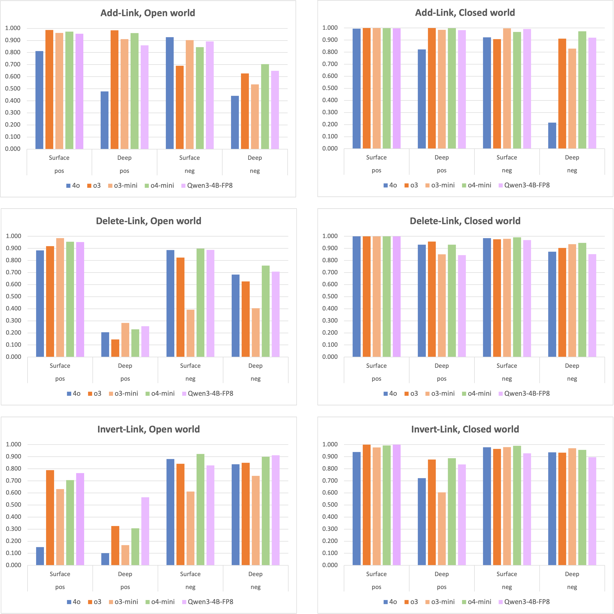
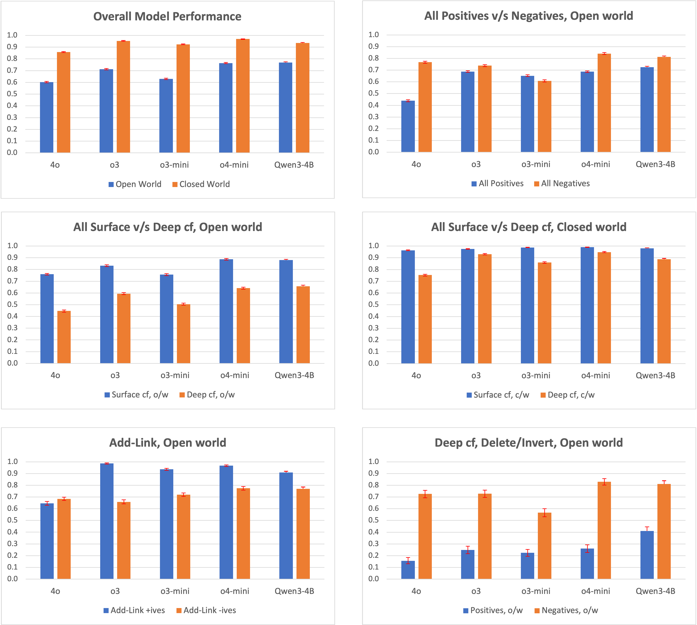

# Experimental Evaluation of some LLMs on the Drug Mechanisms Counterfactuals

We evaluated the following LLMs:

* **ChatGPT 4o**: version gpt-4o-2024-08-06
* **ChatGPT o3**: version o3-2025-04-16
* **ChatGPT o3-mini**: version o3-mini-2025-01-31
* **ChatGPT o4-mini**: version o4-mini-2025-04-16
* **Qwen3-4B Thinking**: version [Qwen3-4B-Thinking-2507-FP8](https://huggingface.co/Qwen/Qwen3-4B-Thinking-2507-FP8), from August 2025 (new, since our FLLM 2025 paper)

## Model Comparisons by Query Types and Mode

The following charts compare the performance of these LLMs on the 3 types of counterfactual queries, in the Open and Closed world modes. In the charts, Surface and Deep counterfactuals are labeled as such, positive queries are labeled as "pos", and negative queries are labeled as "neg". The metrics for the OpenAI models are averaged across 5 runs, but the Qwen3-4B metrics are from a single run.

The Qwen3-4B LLM is the newest model tested, and also likely the smallest with only 4 billion 8-bit parameters (OpenAI does not publish the size of its models). Despite its small size, Qwen3-4B exhibits quite good performance, although it follows the same general pattern of behavior across query types and modes as the other models.

## Grouped Query Comparisons

The charts below highlight some behavior patterns by showing response accuracy metrics grouped by different types of queries (ref. Table VI in our FLLM 2025 paper). Again, metrics for the Qwen3-4B model have been added since the FLLM 2025 paper.

